# 🏗️ Architecture Visualization - Greenhouse Monitoring System

## 📊 Complete System Architecture Diagram

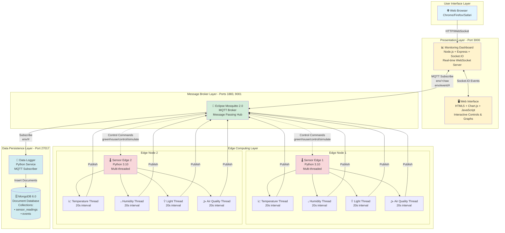

---

## 🔄 Message Flow Architecture

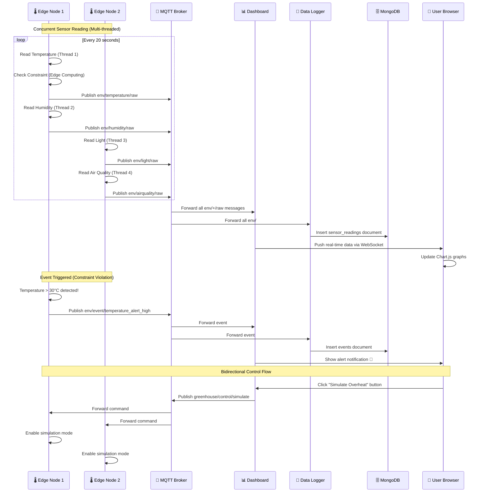

---

## 🧩 Component Interaction Diagram

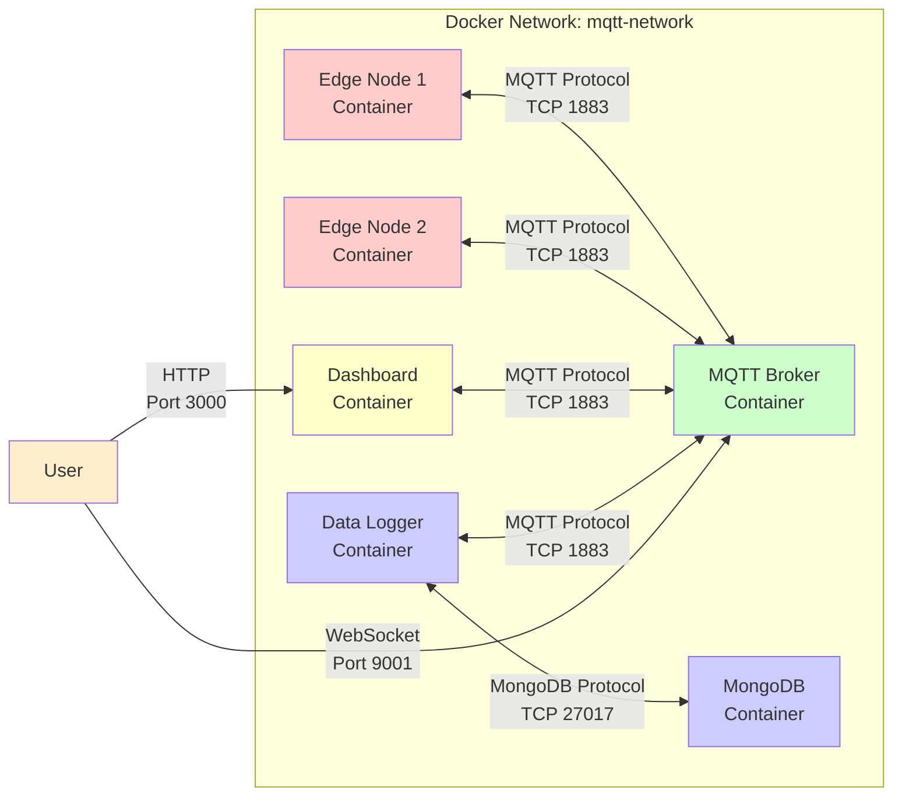

---

## 🎯 Distributed System Principles Visualization

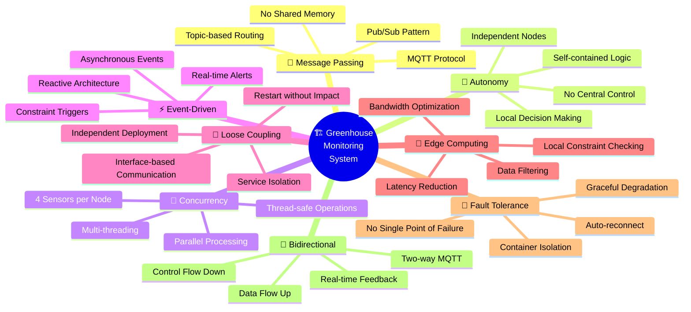

---

## 🌊 Data Flow Architecture

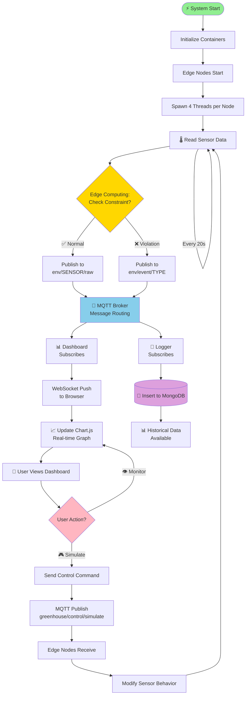

---

## 🏛️ Layered Architecture

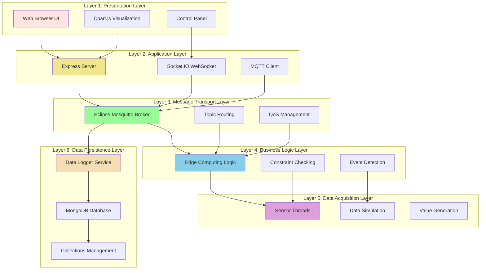

---

## 🔐 MQTT Topic Structure

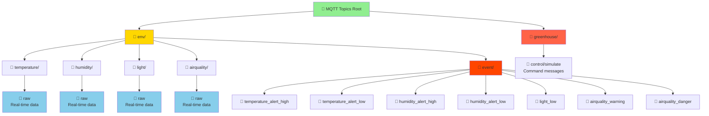

---

## ⚙️ Container Orchestration

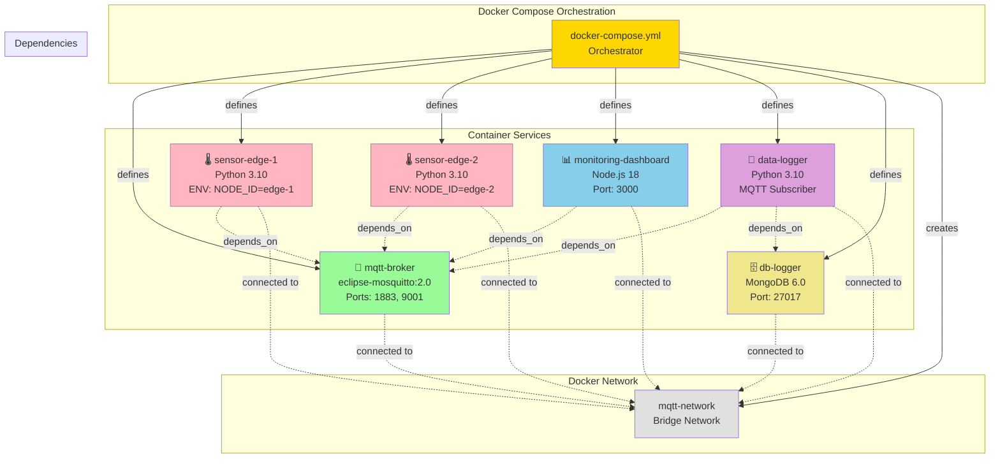

---

## 📈 Real-time Data Pipeline

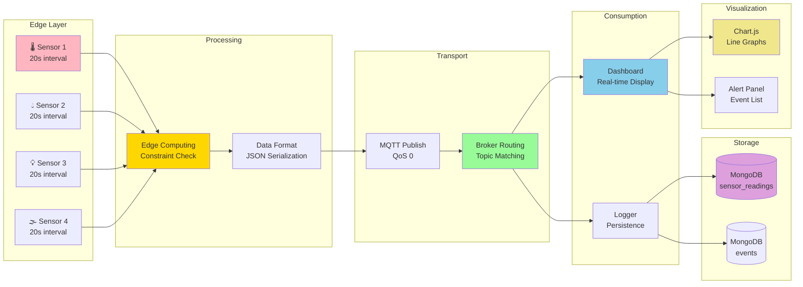

---

## 🛡️ Fault Tolerance Architecture

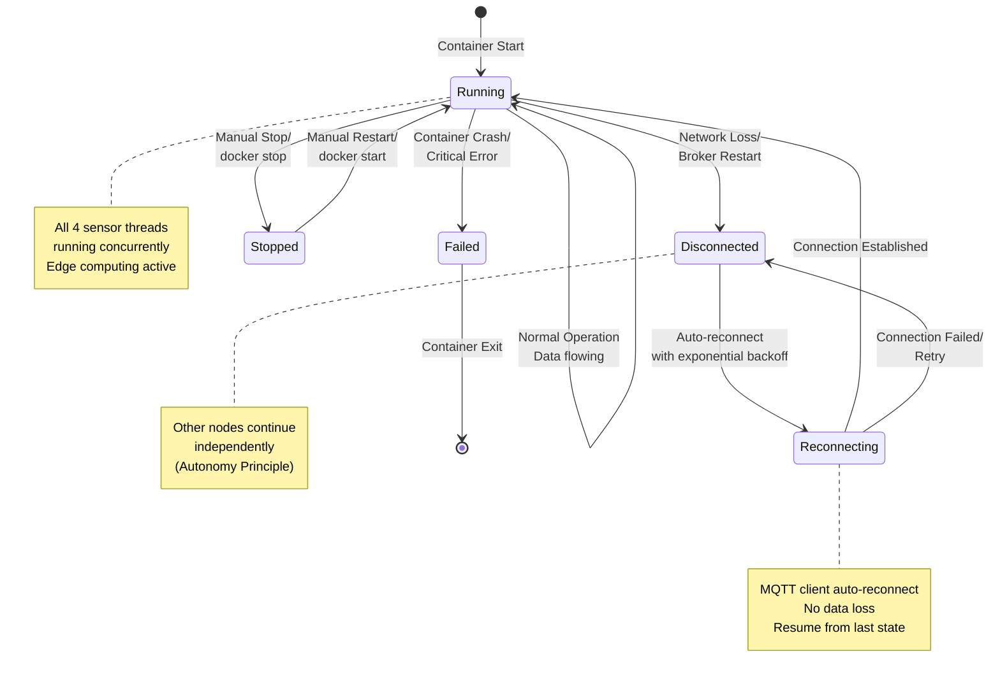

---

## 🎮 Simulation Control Flow

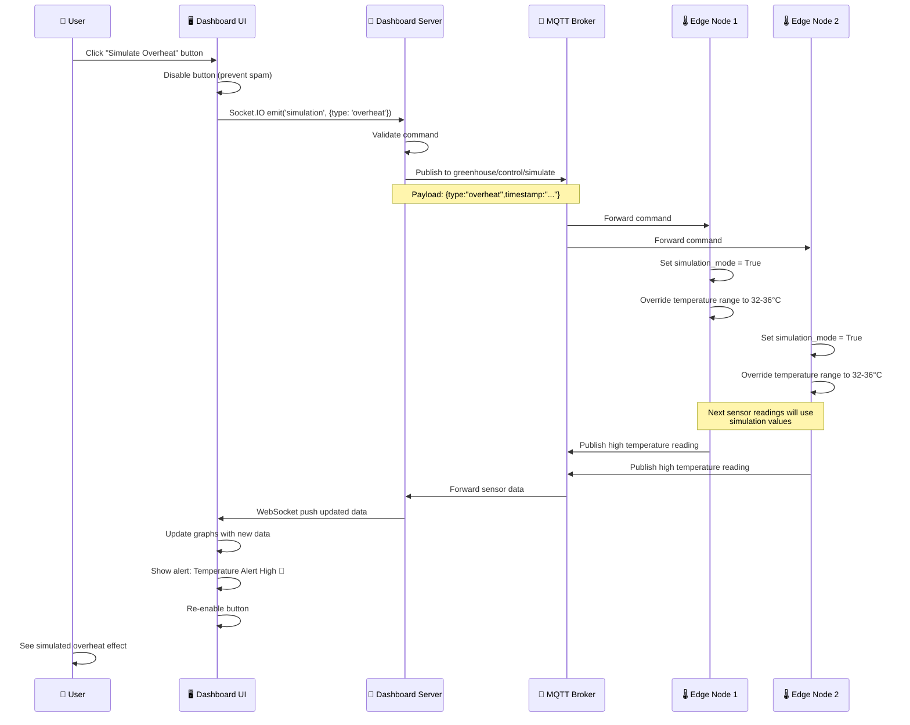

---

## 🔍 Monitoring & Observability

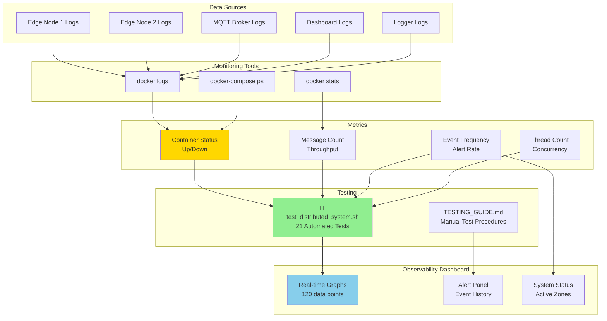

---

## 📦 Deployment Architecture

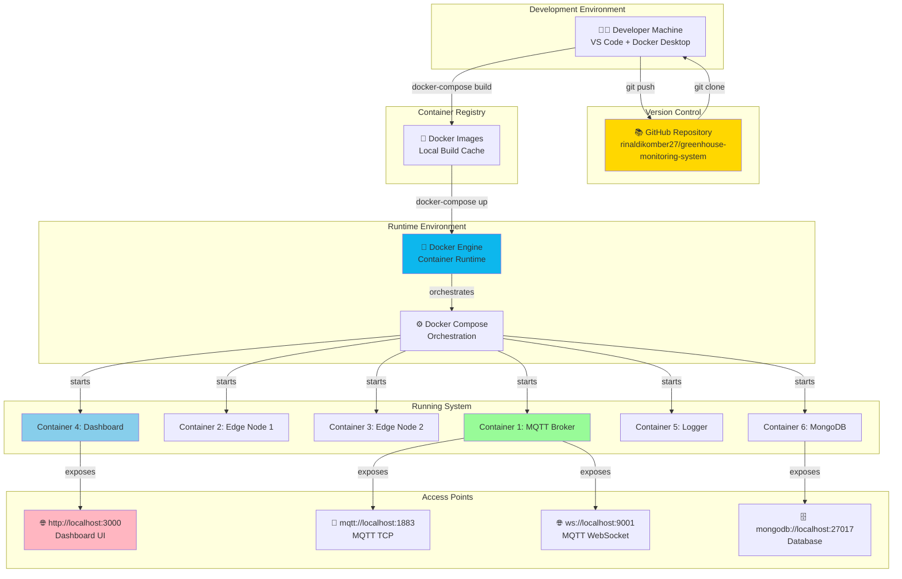

---

## 🎯 Testing Architecture

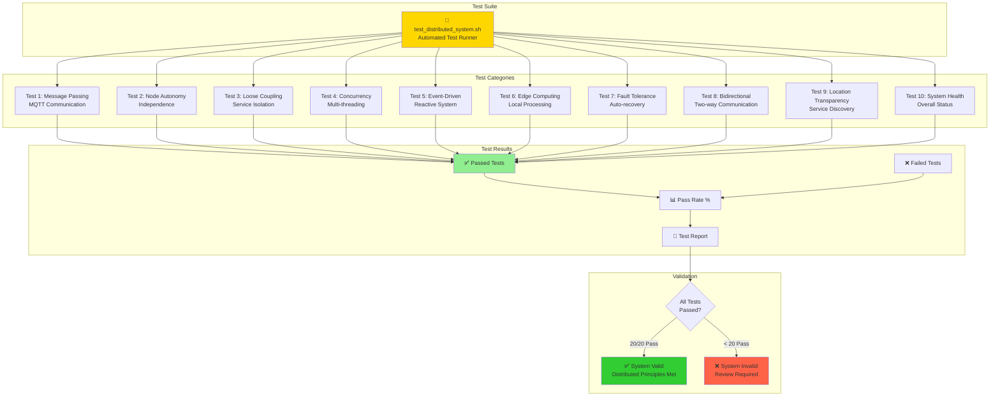

---

## 💡 Key Architecture Insights

### 🎯 Design Decisions

1. **MQTT over HTTP**: Lightweight, efficient pub/sub for IoT
2. **Edge Computing**: Reduce bandwidth, faster response times
3. **Docker Containers**: Service isolation, easy deployment
4. **Multi-threading**: Concurrent sensor operations
5. **WebSocket**: Real-time bidirectional communication
6. **MongoDB**: Flexible schema for sensor data

### 📊 Performance Characteristics

- **Latency**: < 100ms sensor-to-dashboard
- **Throughput**: 12 messages/minute per node (20s intervals)
- **Scalability**: Horizontal (add more edge nodes)
- **Reliability**: Auto-reconnect, fault tolerance
- **Data Retention**: 120 data points in memory, unlimited in DB

### 🔐 Security Considerations

- **Network Isolation**: Docker bridge network
- **Container Isolation**: Separate namespaces
- **No Authentication**: Development environment (add for production)
- **Local Deployment**: No external exposure

### 🚀 Future Enhancements

- Add SSL/TLS for MQTT
- Implement authentication (username/password)
- Add more sensor types
- Implement data aggregation
- Add alerting via email/SMS
- Create mobile app
- Add machine learning for anomaly detection

---

**Generated**: December 4, 2025  
**System**: Greenhouse Environmental Monitoring System  
**Repository**: https://github.com/rinaldikomber27/greenhouse-monitoring-system
